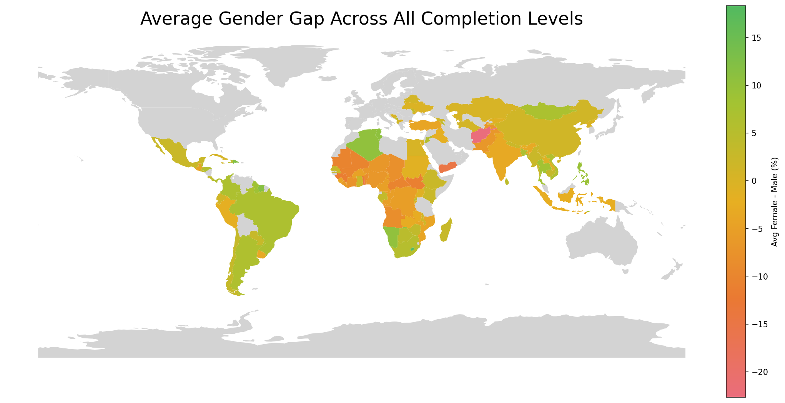
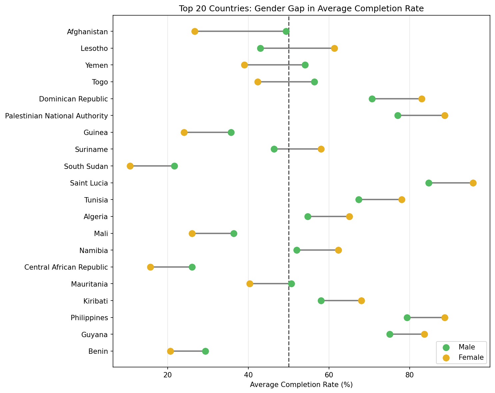
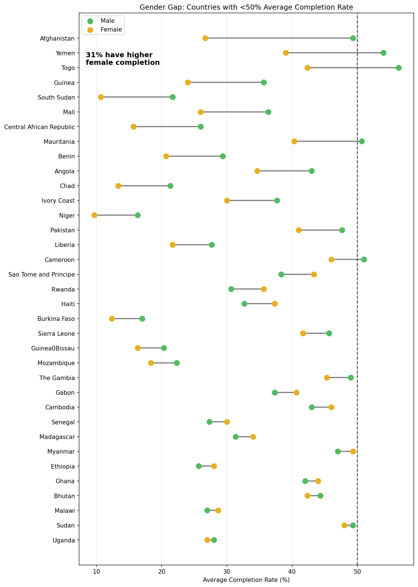
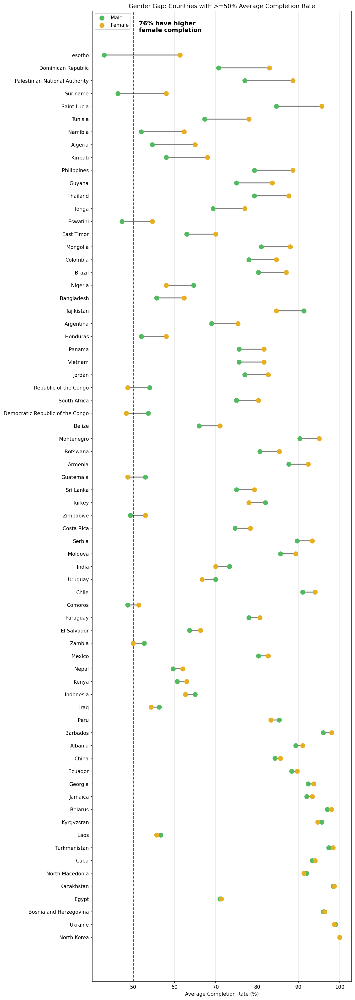

# Gender Gap in Education Completion Rates

This analysis explores where the largest gender gaps in education completion rates occur around the world. We look at completion rates averaged across all education levels (primary, lower secondary, and upper secondary) and examine the economic, social, and behavioral reasons that may explain these patterns.

## Global Overview

The map above shows the average gender gap in completion rates by country. Green countries have higher female completion rates while orange and yellow countries have higher male completion rates. Grey countries have missing data.

Sub-Saharan Africa stands out with the largest gaps favoring males. Countries like Niger, Chad, Mali, and Guinea have some of the widest disparities. Parts of South Asia and the Middle East also show notable gaps where males complete school at higher rates than females.

In contrast, many countries in Latin America, the Caribbean, and parts of Europe show the opposite pattern where females actually complete school at higher rates than males.

## Top 20 Countries with Largest Gender Gaps

Looking at the 20 countries with the biggest gender gaps reveals something interesting. There appears to be a pattern around the 50% average completion mark shown by the dashed line.

Countries below 50% completion tend to have males leading females. Countries above 50% completion tend to have females leading males. This suggests that as countries improve their overall education systems females catch up and eventually surpass males in completion rates.

This pattern was curious and inspired a deeper look at all countries split by their overall completion rates.

## Countries Below 50% Average Completion

Among countries with less than 50% average completion only 30% have higher female completion rates. Males dominate in these lower performing education systems. These are mostly countries in Sub-Saharan Africa where resources are limited and cultural factors may prioritize male education.

## Countries At or Above 50% Average Completion

The pattern flips for countries with 50% or higher average completion. Here 73% of countries have higher female completion rates. Once education systems reach a certain level of development females tend to outperform males in completing their education.

## Possible Reasons for these Patterns

###### The "Old Age Support" Plan

- In many poor countries, there is no government pension. Parents often rely on their children to feed them when they are old. Typically the sons stay and the daughters leave. In many cultures, a son stays with his parents forever. He brings his wife to live with his family. Any money he earns helps the parents. A daughter usually moves away to join her husband's family. If parents spend money educating her, they lose that investment. It benefits her husband's family instead.

- Another likely reason is to escape physical labor. Physical labor pays very little. Parents educate sons so they can get office jobs. These jobs pay steady cash which is essential for the family's survival.

###### Safety and Distance

- In rural areas, schools are far away. Children may need to walk 5 or 10 miles to get there. Therefore, parents worry their daughters' may face harassment or violence on these walks. This often leads to parents keeping girls at home. Boys are generally allowed more freedom to travel alone.

###### The "Boy Crisis" in Classrooms

- In countries where everyone goes to school, boys are starting to fall behind. Research shows girls often develop focus earlier than boys. Modern schools reward sitting still and being organized. Boys are often more restless.

- Boys have more extreme test scores. A large group of boys falls at the very bottom of the class. This group drags down the male average. These boys are at high risk for poverty and crime later in life.

###### Hidden Biases and Confidence

- Even when girls stay in school, they often avoid math or science. Teachers and parents often have unconscious biases and therefore may not encourage girls in math. This lowers the girls' confidence.

- Boys spend more time playing video games. While this can hurt their homework time, it also teaches them computer skills. Girls are often less involved in these technical activities.

## What Can Be Done?

- Teacher Training: Teachers need to learn how to spot their own biases. They should give girls positive feedback in math and science.

- Career Guidance: Schools should show students how much money different careers pay. This might encourage girls to choose higher-paying STEM jobs.

- Pay Transparency: Companies should be open about what they pay men and women. This forces them to fix wage gaps.

---
Research Sources

- https://openknowledge.worldbank.org/entities/publication/c938b653-760a-5440-ad9d-2e11eb1a0381

- https://www.oecd.org/en/publications/gender-education-and-skills_34680dd5-en.html
